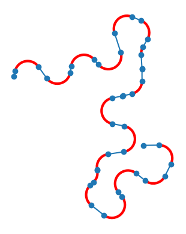
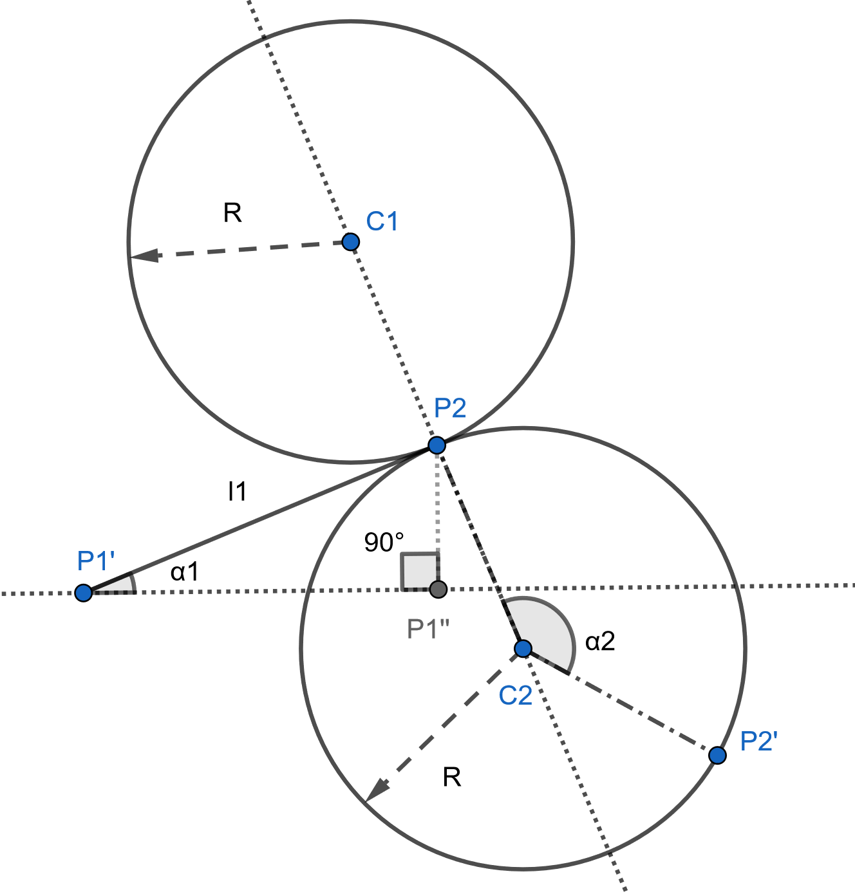

## Introduction

This repository contains a core feature of a student semester project realised in winter 2022. At some point during my project, I wanted to modelize roads as sequences of lines and arc of circles, like this:

 You'll find below my approach to generate them.

## Road generation

Let’s call $P_1′$ the starting point of the road, $l_1$ the length of the first straight section, $α_1$ the angle
determining the direction of the first straight section, $P_2$ the first point of the turn, $P_2′$ the last one,
$α_2$ the angle determining the first turn section, and finally $R$ the radius of turn:

This section describes how to generate the points $P_2$ and $P_2'$ given the starting point $P_1'$, the length of the first straight section $l_1$, and the angles $\alpha_1$ and $\alpha_2$. The process is split into two parts: calculation of $P_2$ and calculation of $P_2'$.

### Step 1: Calculation of $P_2$

Let $\overrightarrow{OP_2}$ be the position vector of $P_2$. According to the Chasles relationship:
$$\overrightarrow{OP_2} = \overrightarrow{OP'_1} + \overrightarrow{P'_1P_2}$$

The vector $\overrightarrow{P_1'P_2}$ is obtained with linear transformation:

$$\overrightarrow{P_1'P_2} = \frac{l_1}{\lVert \overrightarrow{P_1'P_1''} \rVert} R(\alpha_1) \overrightarrow{P_1'P_1''}$$

where $R(\alpha_1)$ is the rotation matrix:
$$R(\alpha_1) = \begin{pmatrix} 
  \cos(\alpha_1) & -\sin(\alpha_1)\\ 
  \sin(\alpha_1) & \cos(\alpha_1)
  \end{pmatrix}$$
and $\lVert \overrightarrow{P_1'P_1''} \rVert$ is the magnitude of the vector $\overrightarrow{P_1'P_1''}$ (obtained by the Pythagorean theorem):

$$\lVert \overrightarrow{P_1'P_1''} \rVert = \sqrt{l_1^2 - (\sin(\alpha_1)l_1)^2}$$

Thus, the position vector $\overrightarrow{OP_2}$ is:

$$\overrightarrow{OP_2} = \overrightarrow{OP_1'} + \frac{l_1}{\sqrt{l_1^2 - (\sin(\alpha_1)l_1)^2}} R(\alpha_1)
\begin{pmatrix}
P_1' + \sqrt{l_1^2 - (\sin(\alpha_1)l_1)^2} \\
P_1'
\end{pmatrix}$$

### Step 2: Calculation of $P_2'$

Next, we calculate the position of $P_2'$. Suppose that $\alpha_2 \in [-\pi, \pi]$. Let us assume that $\alpha_2 < 0$ (this case is illustrated in diagram above).

According to the Chasles relationship: 

$$\overrightarrow{OP_2'} = \overrightarrow{OP_2} + \overrightarrow{P_2C_2} + \overrightarrow{C_2P_2'}$$

The relationship between $C_2$ and $P_2'$ is given by the property of linear transformation:

$$\overrightarrow{C_2P_2'} = R(\alpha_2) \overrightarrow{C_2P_2}$$

Additionally, the vector $\overrightarrow{C_2P_2}$ is:

$$\overrightarrow{C_2P_2} = -\frac{R}{l_1} R\left(-\frac{\pi}{2}\right) \overrightarrow{P_1'P_2}$$

Substituting in the expressions for $\overrightarrow{P_2C_2}$ and $\overrightarrow{C_2P_2'}$, we finally get:

$$\overrightarrow{OP_2'} = \overrightarrow{OP_1'} + \frac{l_1}{\sqrt{l_1^2 - (\sin(\alpha_1)l_1)^2}} R(\alpha_1)
\begin{pmatrix}
P_1' + \sqrt{l_1^2 - (\sin(\alpha_1)l_1)^2} \\
P_1'
\end{pmatrix} + \frac{R}{l_1} R\left(-\frac{\pi}{2}\right) [Id - R(\alpha_2)] \overrightarrow{P_1'P_2}$$
___
If $\alpha_2 \geq 0$, replace $C_2$ with $C_1$.

